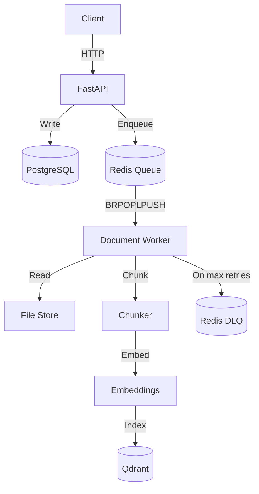

# Async RAG Ingestion Engine

**Part 1 of the Sentinel System - Deterministic Data Pipeline for Financial AI**

This service handles ingestion correctness and failure recovery.  
Workflow correctness is handled by the companion system (`transaction-engine`).

---

## Architecture

The API stays responsive by pushing heavy work to background workers via Redis.



API just coordinates. Workers do the heavy lifting.

---

## Design Decisions

### 1. FastAPI + Async SQLAlchemy

Ingestion is I/O-bound (DB writes, Redis, file uploads), so async makes sense here.

- FastAPI handles concurrent requests without spinning up threads.
- `asyncpg` keeps database calls non-blocking.
- API stays responsive even when the queue backs up.

---

### 2. Redis BRPOPLPUSH (At-Least-Once Queue)

I wanted to keep the queue mechanics visible instead of hiding them behind Celery.

- **Backpressure**: Check queue length before enqueueing; return `429` if full.
- **Ordering**: FIFO.
- **Atomicity**: `BRPOPLPUSH` moves jobs to a processing queue before work starts.
- **Failure Model**: At-least-once delivery, on purpose.

Picked Redis over Kafka/SQS to keep failure semantics inspectable and debuggable in a single-node system.

---

### 3. Qdrant for Vector Storage

Qdrant provides:

- Native HNSW indexing
- Predictable performance under load
- **Deterministic UUID-based point IDs**

Each chunk ID is derived from `(document_id, chunk_index)` using `uuid5`.
This guarantees **idempotent re-indexing** with zero duplicate vectors-even after partial failure.

---

### 4. Pluggable Embeddings

Embeddings use an interface so implementations can be swapped cleanly.

- **Now**: `MockEmbeddingService` - deterministic, free, CI-friendly
- **Later**: OpenAI / Anthropic when real vectors are required

This keeps the ingestion pipeline testable without burning API credits.

---

## Failure Handling

Things break. Here's how the system behaves when they do.

### Redis Unavailable

- **During enqueue**: API fails fast (4xx/5xx depending on failure)
- **During dequeue**: Worker retries with backoff and heartbeat logging

No silent drops. No crashes.

---

### Worker Crash Mid-Processing

- State transitions are explicit and transactional.
- A crash leaves the document in `PROCESSING`.

Safe to retry because:

- Processing is idempotent
- Vector IDs are deterministic
- Re-running overwrites partial work

---

### Duplicate Requests

- Requests are deduplicated by `source`
- Existing documents are returned instead of re-created

This prevents both database and vector duplication.

---

### Partial Indexing

If indexing fails mid-document:

- Previously written vectors are overwritten on retry
- No orphaned or “ghost” vectors remain

This is enforced by deterministic IDs, not cleanup jobs.

---

## Guarantees

1. **Idempotency**
   Same input → same document → same vectors. Always.

2. **At-Least-Once Processing**
   Documents are marked `DONE` only after indexing completes.
   Stuck `PROCESSING` states are expected and safely recoverable.

3. **Backpressure**
   Queue limits are enforced at the API boundary to prevent overload.

4. **State Integrity**
   Strict state transitions prevent race conditions and invalid reprocessing.

This design targets predictable behavior under bursty ingestion rather than infinite horizontal scale.

---

## Failure Semantics

- At-least-once delivery
- Bounded retries (max 3)
- Poison jobs moved to Redis DLQ
- DLQ inspectable via `/admin/dlq`

---

## Out of Scope

Left out on purpose:

- ❌ Auth / multi-tenancy
- ❌ Real LLM calls
- ❌ Paid embedding APIs
- ❌ Distributed tracing

Would've added complexity without improving signal.

---

## Running Locally

### Requirements

- Docker + Docker Compose
- Python 3.12+

### Startup

```bash
# Infrastructure
docker-compose up -d

# Environment
python -m venv .venv
source .venv/bin/activate
pip install -r requirements.txt

# Database
alembic upgrade head

# API
PYTHONPATH=. uvicorn src.main:app --port 8002

# Worker
PYTHONPATH=. python src/workers/document_worker.py
```

---

## Validation

### Benchmarks

```bash
python scripts/benchmark_latency.py
```

Shows p95 latency under load.

### Tests

```bash
pytest -v
```

Covers failure cases, concurrency, and idempotency.
