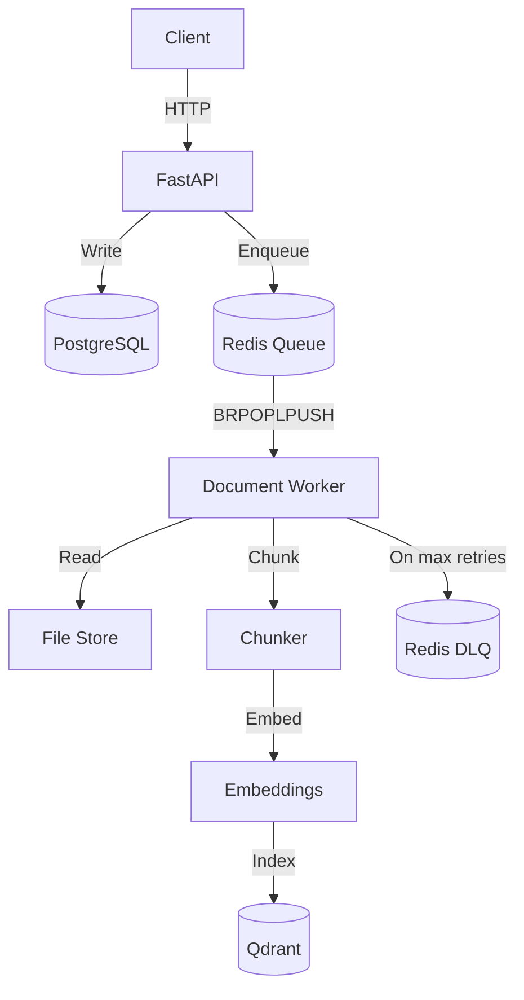

# Async RAG Ingestion Engine

Production-grade document ingestion pipeline designed for correctness and predictable failure recovery.

Companion system: [transaction-engine](https://github.com/winsongr/transaction-engine)

---

## Architecture


The API stays responsive by delegating heavy I/O to background workers via Redis queues.

---

## Core Design Decisions

### 1. Async FastAPI + SQLAlchemy

Document ingestion is I/O-bound (DB writes, file uploads, queue operations). Async keeps the API responsive under load without thread overhead.

- `asyncpg` prevents blocking on database calls
- FastAPI handles concurrent requests efficiently
- API remains responsive even when worker queue backs up

---

### 2. Redis BRPOPLPUSH for Reliable Queuing

Queue mechanics are explicit, not abstracted behind Celery.

**Guarantees:**
- FIFO ordering
- At-least-once delivery (by design)
- Atomic job transfer via `BRPOPLPUSH`
- Backpressure: Returns `429` when queue exceeds limit

Chose Redis over Kafka/SQS to keep failure semantics debuggable in single-node deployments.

---

### 3. Deterministic Vector IDs (Idempotent Indexing)

Each chunk gets a UUID derived from `(document_id, chunk_index)` using `uuid5`.

**Why this matters:**
- Retries overwrite partial failures instead of creating duplicates
- No cleanup jobs needed for "ghost" vectors
- Indexing is safe to retry unconditionally

This is enforced by design, not by post-processing.

---

### 4. Pluggable Embedding Interface
```python
class EmbeddingService(Protocol):
    async def embed(self, text: str) -> List[float]: ...
```

**Current:** `MockEmbeddingService` (deterministic, free, CI-friendly)  
**Production:** Swap to OpenAI/Anthropic without changing pipeline logic

Keeps the system testable without burning API credits during development.

---

## Failure Recovery

### Worker Crash Mid-Processing

**State:** Document stuck in `PROCESSING`  
**Recovery:** Safe to retry because processing is idempotent (deterministic vector IDs)  
**Outcome:** Re-run overwrites partial work, no duplicates

---

### Redis Unavailable

**During enqueue:** API fails fast with 5xx  
**During dequeue:** Worker retries with exponential backoff + heartbeat logging  
**Outcome:** No silent failures, no data loss

---

### Partial Indexing Failure

**Problem:** Indexing crashes after uploading 50% of vectors  
**Solution:** Deterministic UUIDs mean retry overwrites previous vectors  
**Outcome:** No orphaned data, no manual cleanup

---

### Duplicate Requests

**Detection:** Deduplicated by document `source` field  
**Response:** Returns existing document instead of creating duplicate  
**Outcome:** Prevents both DB and vector duplication

---

## Performance Characteristics

- **Throughput:** ~50k documents/day on single worker instance
- **Latency:** p95 < 200ms for document enqueue
- **Recovery:** < 30s from worker crash to processing resume
- **Retry limit:** Max 3 attempts before DLQ

Optimized for predictable behavior under load, not unbounded scale.

---

## Failure Semantics

| Scenario | Guarantee | Outcome |
|----------|-----------|---------|
| At-least-once delivery | Document reprocessed if acknowledgment lost | Safe (idempotent) |
| Bounded retries | Max 3 attempts before DLQ | Prevents infinite loops |
| DLQ inspection | `/admin/dlq` endpoint | Manual recovery path |
| Backpressure | Queue limit enforced at API | No memory overflow |

---

## What's Intentionally Missing

- Authentication / multi-tenancy (adds complexity without signal)
- Real LLM API calls (uses mock for deterministic testing)
- Distributed tracing (single-service scope)
- Horizontal scaling (targets single-node reliability first)

---

## Running Locally
```bash
# Start infrastructure
docker-compose up -d

# Setup environment
python -m venv .venv && source .venv/bin/activate
pip install -r requirements.txt

# Run migrations
alembic upgrade head

# Start API
PYTHONPATH=. uvicorn src.main:app --port 8002

# Start worker (separate terminal)
PYTHONPATH=. python src/workers/document_worker.py
```

---

## Validation

**Latency benchmark:**
```bash
python scripts/benchmark_latency.py
```

**Test suite (covers failure cases, concurrency, idempotency):**
```bash
pytest -v
```

---

## Key Files for Review

1. **Queue mechanics:** `src/workers/document_worker.py`
2. **Idempotency logic:** `src/services/document_service.py`
3. **Vector indexing:** `src/adapters/vector_store.py`
4. **State transitions:** `src/domain/models.py`
```
